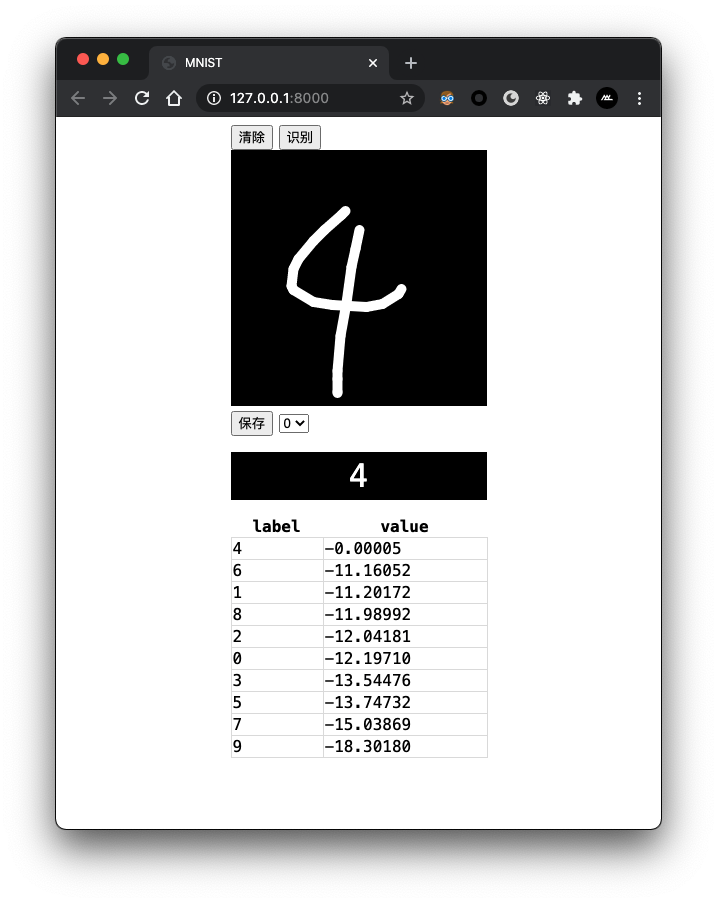

# 神经网络识别手写数字

使用卷积神经网络，在MNIST数据集上训练。

## 开发

> 建议: `Python 3.8`

```bash
# 创建venv虚拟环境
python3 -m venv .venv

# 激活虚拟环境
source .venv/bin/activate

# 安装依赖
pip install -r requirements.txt
```

## 使用

> **在使用cli测试或者开启服务器之前先运行`python -m main train`，保证已经拥有训练模型后再启动进行测试。**

```bash
# 训练
# 训练会将模型参数存于data/model.pl中
python -m main train

# 使用用户生成的图片来训练
python -m main train_user

# 将测试集中的前100张图片解压到data/extract目录中
python -m main extract

# 预测IMAGE PATH文件中的手写数字
python -m cli <IMAGE PATH>

# 开启web服务器
uvicorn app.main:app
```

## web


